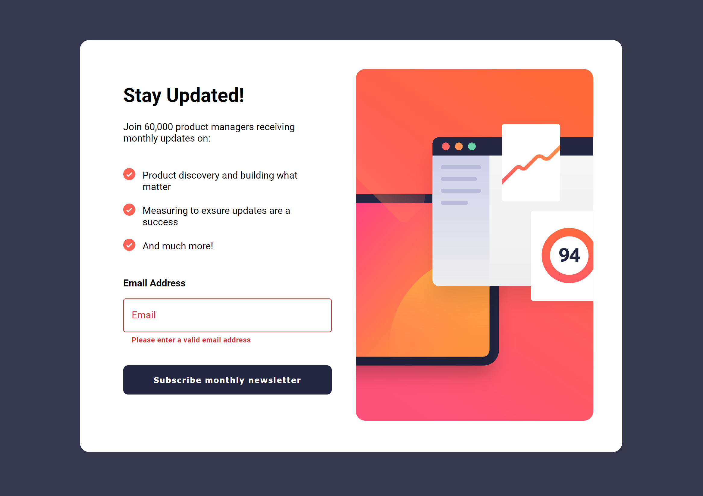
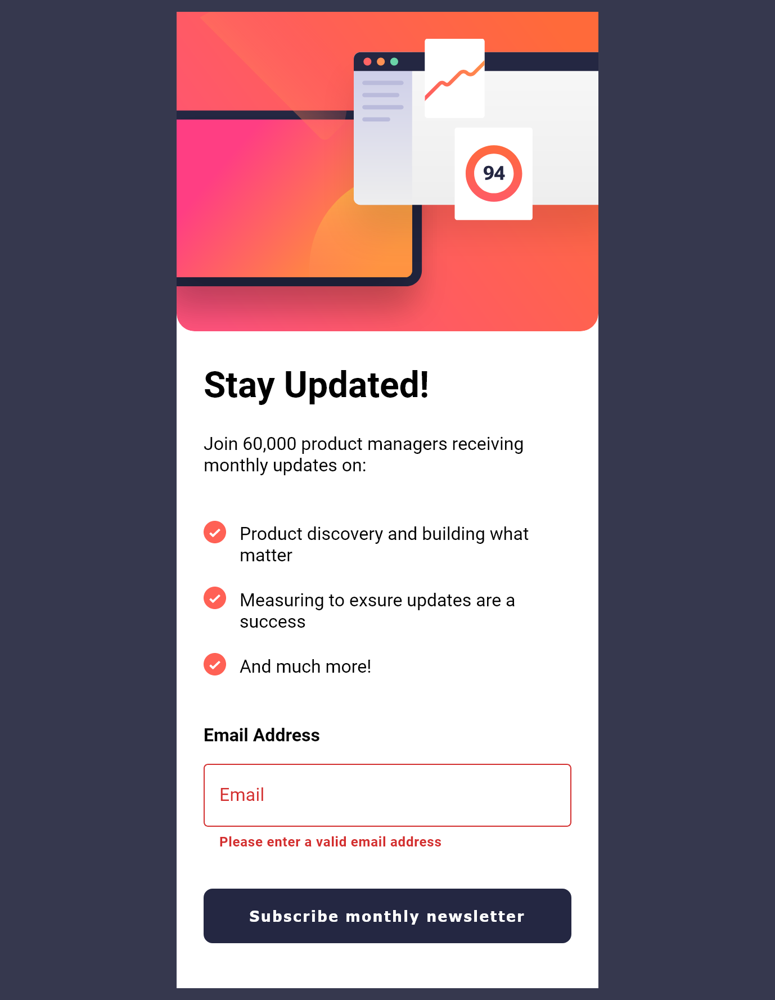

# Frontend Mentor - Newsletter sign-up form with success message solution

This is a solution to the [Newsletter sign-up form with success message challenge on Frontend Mentor](https://www.frontendmentor.io/challenges/newsletter-signup-form-with-success-message-3FC1AZbNrv). Frontend Mentor challenges help you improve your coding skills by building realistic projects. 

## Table of contents

- [Overview](#overview)
  - [The challenge](#the-challenge)
  - [Screenshot](#screenshot)
  - [Links](#links)
- [My process](#my-process)
  - [Built with](#built-with)
  - [What I learned](#what-i-learned)
  - [Continued development](#continued-development)
  - [Useful resources](#useful-resources)
- [Author](#author)
- [Acknowledgments](#acknowledgments)

**Note: Delete this note and update the table of contents based on what sections you keep.**

## Overview

### The challenge

Users should be able to:

- Add their email and submit the form
- See a success message with their email after successfully submitting the form
- See form validation messages if:
  - The field is left empty
  - The email address is not formatted correctly
- View the optimal layout for the interface depending on their device's screen size
- See hover and focus states for all interactive elements on the page

### Screenshot

### Links

- Solution URL: [Github URL](https://github.com/Stevish1968/newsletter-update)
- Live Site URL: [Site URL](https://stevish1968.github.io/newsletter-update/)

## My process

### Built with

- Semantic HTML5 markup
- CSS custom properties
- Flexbox
- CSS Grid
- Mobile-first workflow
- [React](https://reactjs.org/) - JS library

### What I learned

This project helped me in learning on how to go about planning the layout of the project. It took me sometime to figure out how I wanted to go about completing this project. I was between flexbox and grid and I'm still not sure if I did things right and will likely redo this project to improve things. It was also good practice with react, sending state and values through props. I also added Material UI for the text feild for the styling.

### Continued development

I hope to keep learning how to code CSS better as well as to use Semantic HTML so that my sites have proper structure. I also want to continue learning React and look foward to understanding context and React Router.

### Useful resources

- [Stack Overflow](https://stackoverflow.com/) - As everybody knows this is an amazing source of information and one of my goto places.
- [Colt Steele](https://www.coltsteele.com) - Colt is an amazing instructor and I have taken a lot of his courses and would recommend him for sure.

## Acknowledgments

The guys on the discord server for Colt Steele are amazing and so very helpful, I would recommend you heading over there if you want to lean from some very knowledgeable guys. They have helped me out in more ways then just coding.